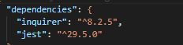
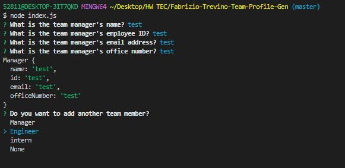
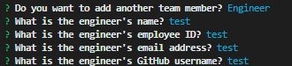
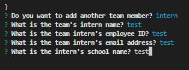

# Team Profile Generator

## Description

This is a Node.js command-line application that generates an HTML webpage displaying a summary for each employee on a software engineering team. The application prompts the user for information about each team member, including their name, employee ID, email address, and other information depending on their role. The generated webpage displays the information in a nicely formatted team roster.

## Installation

To use this application, clone the repository and run npm install to install the necessary dependencies, including Inquirer version 8.2.4 and Jest.

## Usage

To run the application, use the command:node index.js

You will be prompted to enter the team manager’s name, employee ID, email address, and office number.

Then you will be presented with a menu with the option to add an engineer or an intern or to finish building your team. When you select the engineer option, you will be prompted to enter the engineer’s name, ID, email, and GitHub username.

Finally taken back to the menu. When you select the intern option, you will be prompted to enter the intern’s name, ID, email, and school name, and then taken back to the menu. When you decide to finish building your team, the HTML is generated and saved to the public directory.

## Walkthrough Video

Please click on this [Link](https://drive.google.com/file/d/1ic-Nw3cnzF_7WXoqJLvSHjSKXAACkc21/view) to view a walkthrough video demonstrating the application's functionality and all of the tests passing: Video Link
